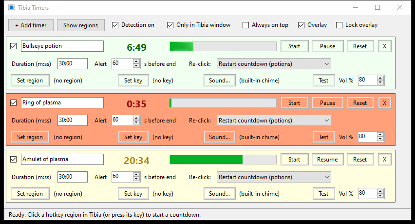
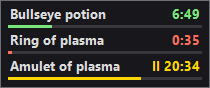

# Tibia Timers

A small Windows helper for Tibia that plays a sound shortly before your buffs run out, like a **bullseye potion**, a **ring of plasma** or an **amulet of plasma**.

You mark the screen area where the item's action bar slot sits, or assign its keyboard hotkey. When you click that slot or press that key in Tibia, a countdown starts. A few seconds before it ends, the sound you picked plays. A small always-on-top overlay shows all running countdowns.





## Features

- **Click or key triggers:** drag a box over the hotkey slot, set a keyboard hotkey (Shift, Ctrl and Alt combos work), or use both.
- **Any sound file:** `.mp3`, `.wav` or `.wma`, with a volume setting per timer. A built-in chime plays if no file is set or the file goes missing.
- **Early alert:** set how many seconds before the end the sound plays, and use any duration from seconds up to 24 h (`10`, `9:30`, `1:00:00`).
- **Re-click behaviour per timer:**
  - *Restart countdown*: re-drinking a potion refreshes the timer.
  - *Pause / resume*: taking a ring or amulet off pauses it and putting it back on resumes it, the same way Tibia handles them.
  - *Ignore while running*.
- **Only in Tibia window:** clicks and keys in other programs are ignored. Double-clicks count once.
- **Overlay:** a compact, draggable, always-on-top countdown list. *Lock overlay* makes clicks pass through it into the game.
- **Survives restarts:** running countdowns continue after you close and reopen the app. Settings are stored in `TibiaTimers.ini` next to the exe.
- **Single small exe with no dependencies.**

## Building

You need **Windows 10 or 11**. The .NET Framework 4.x compiler that comes with Windows is all it uses; you don't need Visual Studio or the .NET SDK.

```powershell
git clone https://github.com/Xirate/tibia-timers.git
cd tibia-timers
powershell -ExecutionPolicy Bypass -File build.ps1
```

This creates `TibiaTimers.exe` in the same folder. To compile by hand instead:

```powershell
& "$env:WINDIR\Microsoft.NET\Framework64\v4.0.30319\csc.exe" /target:winexe /optimize+ /out:TibiaTimers.exe /r:System.Windows.Forms.dll /r:System.Drawing.dll TibiaTimers.cs
```

Close the app before rebuilding, because Windows locks an exe while it is running.

## Usage

1. Run `TibiaTimers.exe`. It starts with three example timers. Edit their names and durations, or add your own.
2. For each timer, click **Set region** and drag a box over the item's action bar slot in Tibia. A single click marks one slot. **Show regions** displays all your boxes.
3. Optional: click **Set key** and press the Tibia hotkey you use for that item.
4. Click **Sound...** to pick a file, and set **Alert _N_ s before end**.
5. Play. Using the slot starts the countdown, and the sound plays before it ends.

## Notes

- **Nothing triggers:** if you run Tibia as administrator, run Tibia Timers as administrator as well.
- **Fullscreen:** the overlay can't draw over *exclusive* fullscreen. Use borderless fullscreen or windowed mode.
- **Pause / resume:** this assumes your ring or amulet hotkey takes the item off when it's already on. If it doesn't for you, switch that timer to *Restart countdown*.
- **What it does to the game:** nothing. It only listens for your own mouse clicks and key presses, then plays sounds. It never reads or changes the game client and never sends any input. Check the game rules yourself if you're unsure.

Not affiliated with or endorsed by CipSoft GmbH. Tibia is a trademark of CipSoft GmbH.

## License

[MIT](LICENSE)
